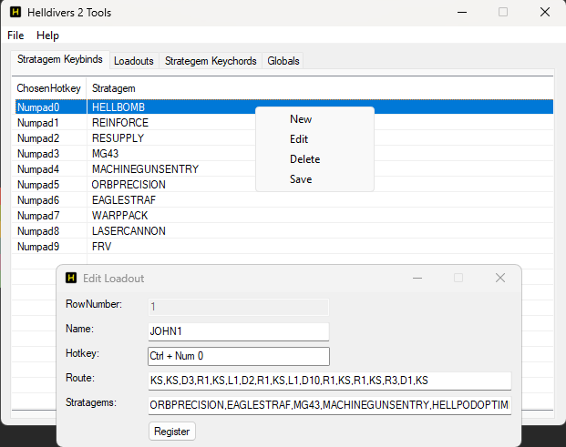
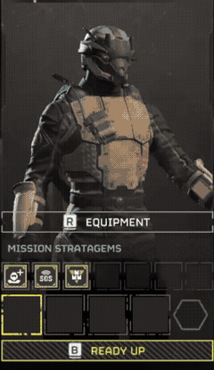

# Helldivers 2 Tools

Helper tool for Helldivers 2 to add a simple loadout functionality and reduce repetitive stress.



## Quickstart

*Note: This tool expects you to remap your stratagem keys to the Up,Down,Left,Right arrow keys. Please ensure you have done this.*

Download [https://www.autohotkey.com/v2/](https://www.autohotkey.com/v2/). This is required to run if you are running it from the AutoHotkey script. If using the executable release, this step isn't needed.

Download the tool, if needed extract the zip file.

Within the extracted folder, double click the `main.ahk` or `main.exe` to launch the application.

Looking for a deeper dive into the tool configurations? Continue reading.

## General Usage

Tool should only enable the hotkeys when it detects the application "HELLDIVERS™ 2".

*Note: Again, this tool expects you to remap your stratagem keys to the Up,Down,Left,Right arrow keys. Please ensure you have done this.*

### Configuration Location

On first run, or if the `.\configs` folder does not exist, it will be created as a copy from `default-configs`. This is where all your changes will be saved. To backup any configurations you have, just backup the `.\configs` folder, and replace it later as needed.

### How to configure things

Manipulating records can be done by:

- right-clicking context menu on each respective listview
- double-clicking on an existing row will allow editing that item

There is no confirmation message on success of editing or adding an item. But, it can be seen populating into the list.

Currently, only singular additions and edits are allowed via the GUI. However, multiple deletions can occur if more than one item is selected.

All changes within the Gui will work upon registering them. However, they will not apply themselves to their respective configuration files until you choose the save options (either for each listview context menu, or through File -> Save All Settings).

If needed, the configuration is stored in `ini` files and can be edited manually using a text editor.

## Ini Configurations

Consists of three files:

- `config.ini`: Contains global values used for settings key press times
- `loadouts.ini`: Contains loadout Name, ChosenHotkey, Route, Stratagems (for the moment "Stratagems" here is only for ease of identifying what the Route is)
- `stratagems.ini`: Listings of all in-game stratagem names and their keychords

### config.ini

All these values represent milliseconds. So, 1000 = 1 second.

*Sleep_Default* = default sleep time between keychords up and down (mainly for strategem dialing)

*Sleep_Loadout_Stage1* = sleep time as key is being pressed down (for loadout selection)

*Sleep_Loadout_Stage2* = sleep time when a key is released (time until next keydown, in loadout selection)

*Sleep_Loadout_Spacebar_Stage2* = sleep for spacebar keyup until next key, you may need to adjust as it's based on pc performance (loadout selection)

*Sleep_Loadout_SpacebarLong* = sleep for spacebar down first run, to let strategem menu load properly (adjust longer if needed per pc performance, for loadout selection)

Default Settings for `config.ini`:

```Ini
[Globals]
Sleep_Default=50
Sleep_Loadout_Stage1=50
Sleep_Loadout_Stage2=250
Sleep_Loadout_Spacebar_Stage2=250
Sleep_Loadout_SpacebarLong=1000
```

### loadouts.ini

Due to the amount of unknowns when it comes to what people have unlocked, defining loadouts relies on simple keypresses.

The loadouts selection is meant to be launched on the stratagems selection screen, from the pre-selected first stratagem slot. Starting from a different position will cause issues.

The Route for a loadout is found by looking at your strategems within the selection box, and making the list of each move you would do yourself using keyboard controls. Then record those. Unlocking new stratagems will mean you need to adjust your loadout route.

An example loadout showing how they should be setup (assuming everything unlocked at time of this manual):

```Ini
[RECON1]
ChosenHotkey=^Numpad0
Route=KS,D8,KS,D3,R2,KS,L2,D3,KS,D1,R1,KS,R1,KS,R2,KS
Stratagems=LASERCANNON,WARPPACK,FRV,MACHINEGUNSENTRY,SPRINTBOOSTER
```

Notice that the loadouts configuration does not list each keypress like the stratagem keychords. Instead, it can be shortened using a letter (for arrow direction) + number of times to press. This cannot be done with the 'KS' or Spacebar though. Spacebar is used to select an item.

*Note: Currently, the "Stratagems" item list in the loadouts are only for our benefit to see what the route is. They were typed in manually.*

If we break down the keychord above for RECON1 here is what will happen:

Spacebar, Down x8, Spacebar, Down x3, Right x2, Spacebar, Left x2, Down x3, Spacebar, Down x1, Right x1, Spacebar, Right x2, Spacebar



It was more consistent to reset the position of the selected item back to the left most item. This is why Left movement is shown in the example. This way, when traversing sections in the stratagem lists, you will always know the selected position is to the left.

After completing it's task, you should be returned to the stratagem selection screen where to can ready up for the match.

### stratagems.ini

This configuration file holds two sections:

- StratagemKeybinds
- StratagemsAndKeychords

#### StratagemKeybinds

StratagemKeybinds will store your hotkey and stratagem combinations in the following format:

```Ini
0=Numpad0,HELLBOMB
```

Be sure if you edit this file manually that you include a prefix number on the left of the '=' sign.

#### StratagemsAndKeychords

StratagemsAndKeychords is the list of all in-game stratagems with their keychords.

Keychord shortcuts are defined within the scripts as the following:

- `KS`: Spacebar (for selecting loadout item, not used for stratagem keychords)
- `KU`: ArrowUp
- `KD`: ArrowDown
- `KL`: ArrowLeft
- `KR`: ArrowRight

When setting stratagem keychords for configurations be sure these are the only ones used. If something fails, be sure to double check that they are correct and properly comma'd.

You will not need to add anything for the Left Control button. That is handled internally by the scripts when entering a stratagem. The script will not throw a stratagem for you, only dial the chords.

As shown example below:

```Ini
AIRBURSTROCKET=KD,KU,KU,KL,KR
ANTIMATRIFL=KD,KL,KR,KU,KD
```

Example actions:


## Configuring Hotkey Keybinds

Loadouts and Keybinds allow for configuring their hotkeys by pressing the desired hotkey combination. You will see it updating as keys are being pressed.
 
Note, there is a limitation within AutoHotkey where not all possible combinations can be handled via the "Hotkey" input field. As an example, using the GUI to set keybinds, it's possible to set 'Control + 5' (^5), but not 'LControl + 5' (<^5).

If you want more advanced keybindings, you will need to edit the ini files directly. Note however, that any keybinds not supported by AutoHotkey's Hotkey input field will not display within the GUI and must be managed via the ini configuration files. Refer to AutoHotkey's documention at [https://www.autohotkey.com/docs/v2/](https://www.autohotkey.com/docs/v2/) for further information.

## Issues

Little to no error checking implemented. Ensure proper functioning with the following:

- Keychords, Routes, and stratagem names should be uppercase (tries to convert on ini import)
- Keychords, Routes, etc should be separated with a ','
- Keychords, Routes, Loadout Stratagem list will always be at least 2 chords long (error on single chord or no ',')
- Don't add leading or trailing ',' to the lists for the moment


